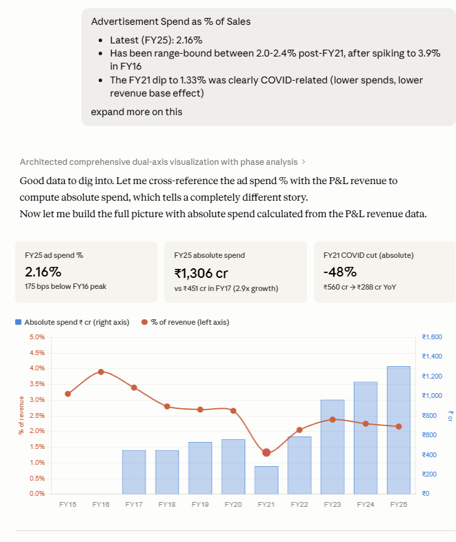
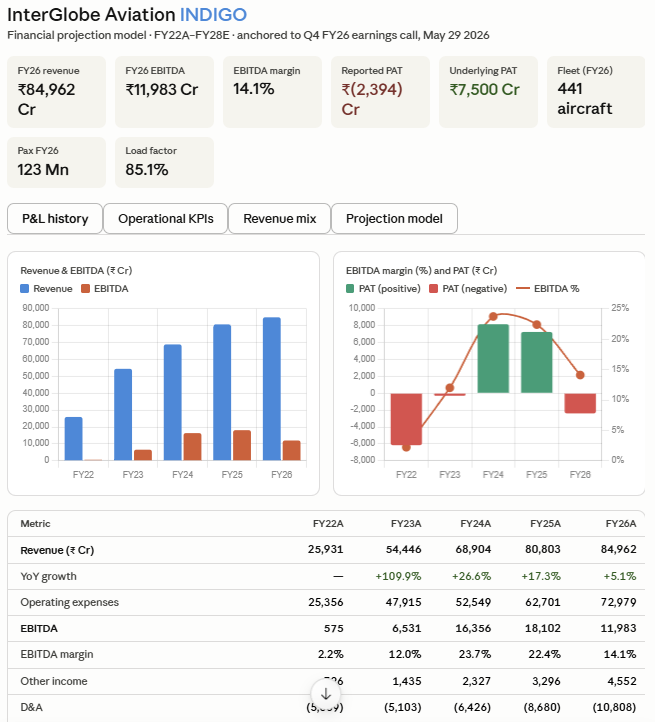
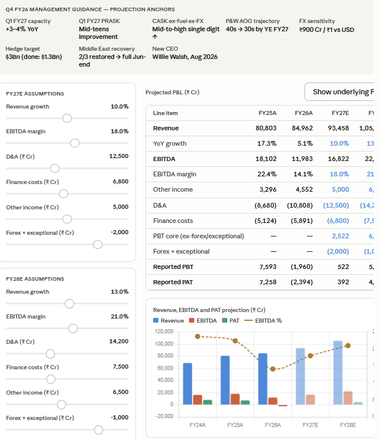
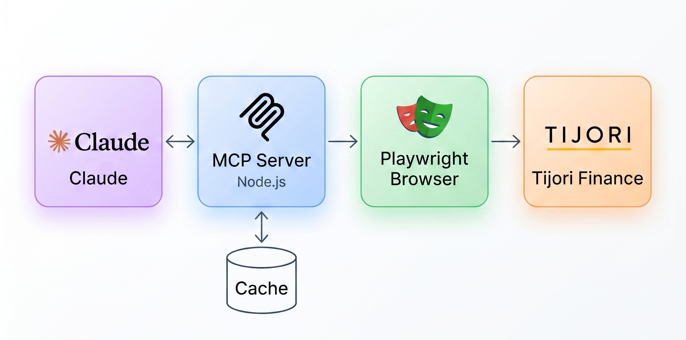

<div align="center">


# Tijori Finance MCP

**India's first MCP server for Indian equity research.**

Talk to 5,000+ NSE/BSE listed companies directly from Claude.

[](https://nodejs.org)
[](https://modelcontextprotocol.io)
[](LICENSE)
[](https://tijorifinance.com)
[]()

</div>

---


## What you can do

```
"Pull Zomato's last 6 quarters of revenue and EBITDA margin, then read their
latest concall transcript — are they hitting the targets management guided for?"

"Bajaj Finance's FII stake dropped 400bps last year while promoters held flat —
pull their latest investor presentation to figure out if this is distribution or passive rotation."

"Crude is up — check the raw materials data for chemical spreads, then pull
revenue mix and operational metrics for Deepak Nitrite to see if margins are at risk."
```

<video src="https://github.com/user-attachments/assets/15e976d9-872a-494d-8aea-ce369de9cd01" controls muted autoplay loop width="100%"></video>

---

> *"The goal is to turn data into information, and information into insight."*
> — Carly Fiorina

---

## In Action

### 1 — Cross-tool deep dive: Titan
*Revenue mix pulled first, then cross-referenced against P&L data to explain trends*



---

### 2 — IndiGo: P&L history
*Full income statement history retrieved in one call — revenue, EBITDA, PAT across years*



---

### 3 — Concall → Financial projection
*Knowledge base fetched the latest earnings call transcript, Claude read it and built a forward projection model*



---

## Why this exists

Most financial MCP servers are built for US markets — Yahoo Finance, SEC filings, S&P data.

**Nothing existed for India.**

Tijori Finance is the most comprehensive source for Indian equity data — operational KPIs, revenue segment breakdowns, market share trends, and curated investor documents that aren't available anywhere else. This MCP server exposes all of it to Claude.

| Feature | **Tijori Finance MCP** | Traditional Research | Bloomberg / Refinitiv |
|---|---|---|---|
| **Setup Time** | 5 minutes | Hours (Python, Excel...) | Weeks (Contracts) |
| **Cost** | Free + Tijori subscription | Variable | $30k+/year |
| **Indian Market Coverage** | ✅ 5,000+ NSE/BSE stocks | ❌ Fragmented / manual | Partial |
| **Operational KPIs** | ✅ Segment data, KPIs, market share | ❌ Manual scraping | ✅ Proprietary |
| **Concall Transcripts** | ✅ Earnings calls, investor docs | ❌ PDF hunting | Partial |
| **AI-Ready Output** | ✅ Structured JSON → Claude | ❌ Unstructured pages | ❌ Proprietary only |
| **API Keys Required** | None | Multiple (OpenAI, etc.) | N/A |

<details>
<summary><strong>What makes this different from a web search?</strong></summary>

A web search gives you unstructured pages. This gives Claude **structured, queryable data** — historical time series, typed fields, and consistent schemas across all 5,000+ companies. Claude can reason over it, compare across companies, and build analyses — not just summarize a webpage.

</details>

---

## Tools

### v1 — Stable

| Tool | What it does |
|---|---|
| `search_company` | Search any company by name, returns slug |
| `get_company_overview` | Key ratios, forensics score, market cap, PE, ROE, ROCE |
| `get_financials` | P&L, Balance Sheet, Cash Flow, Ratios, Quarterly results |
| `get_shareholding` | 10-quarter promoter / FII / DII / public breakdown |
| `get_operational_metrics` | All operational KPIs with full historical time series |
| `get_fund_flow` | Capital allocation breakdown over 1/3/5/7/10 years |
| `get_revenue_mix` | Segment breakdown with historical trend per segment |
| `get_market_share` | Market share % per metric with as-of date |
| `get_knowledge_base` | Annual reports, earnings releases, investor presentations, conference calls — returns URLs grouped by type |
| `fetch_document` | Fetch and extract full text from a PDF URL returned by `get_knowledge_base`. Reads through the authenticated session to bypass CDN access controls |
| `get_raw_materials` | Commodity price performance — chemicals, spreads, metals |
| `get_macro_indicators` | India macro — credit, IIP, GST, auto sales, GDP, trade |
| `get_markets` | Index performance — Nifty, sector indices, conglomerates |
| `get_sector_constituents` | All stocks inside a TJI niche sector index. Pass `tjiid` from `get_markets("niche")`. Returns slug, market-cap weight, and 1D–10Y price returns per stock |
| `get_conglomerate_constituents` | All companies inside a business group. Pass `tjiid` from `get_markets("conglomerates")`. Returns slug and 1D–10Y price returns per stock |
| `resolve_company_ids` | Resolve slug to numeric company ID |

### v2 — In Development

| Tool | What it does |
|---|---|
| `list_popular_screens` | Browse Tijori's pre-built stock screens, grouped by category, with each screen's description and underlying query |
| `screen_companies` | Run a popular screen by name (`preset`) or screen 5,000+ stocks with Tijori's full query language — `%` values, field-vs-field comparisons, arithmetic like `capex/Net Block > 0.5`, plus business-data queries (`alternate`) like `market share > 50` or `revenue from Defence > 50` |
| `search_screener_fields` | Search the ~1,500-metric field catalog (with time-period variants like `3yr Avg ROCE`, `10Yrs ago PAT`) to find exact field names for `screen_companies` |
| `analyze_portfolio` | Pass a list of company slugs — get back sector distribution, weighted avg PE/ROE/OPM, forensics spread, and promoter pledge flags across the whole portfolio |

> v2 tools are functional but not yet stable — expect occasional breakage.

---

## What's New

### 2026-06-12 — Screener overhaul

- **Alternate data queries.** The Advanced Screener's second box now works ad-hoc: `screen_companies({ alternate: "market share > 50" })` or `{ alternate: "revenue from Defence > 50", filters: "Market Capitalization > 1000" }`. Relationships: `makes`, `revenue from`, `market share`, `uses`, `caters to`, `has plant in`, combinable with AND/OR/NOT.
- **The three screener checkboxes.** `latest_results_only` (only companies that reported the latest quarter), `superstar_investors` (only companies a whale investor holds, with the holder named per row), and `sme` (search the SME-listed universe).

- **Popular screens actually run now.** `list_popular_screens` previously returned queries with the `AND` glued to the next field name (newlines in the page's links were being stripped), and dropped each screen's category, description, market-share query, and superstar-investor flag. It now returns all of those, and `screen_companies { preset: "Monopoly Companies" }` runs any of them through the same endpoint the website uses — including the ones advanced queries can't express.
- **The advanced screener exposes Tijori's full query language.** Queries support every field in Tijori's catalog, `%` values (`ROCE > 20%`), comparisons between fields (`Net Sales > 3Yrs ago Net Sales`), and arithmetic (`capex/Net Block > 0.5`).
- **New `search_screener_fields` tool.** Tijori has ~1,500 financial metrics once you count time-period variants (`3yr Avg ROCE`, `5yr Growth Net Sales`, `10Yrs ago PAT`…). Search the catalog to find the exact name, then use it in a query.
- **Result caps.** Screens used to return every matching row (1,000+ for loose queries). Results are now capped at 50 by default (`limit` raises it); `total_results` still reports the full count.

### 2026-06-10 — Reliability & performance

- **Long, multi-tool queries no longer time out.** Asking for a full workup in one go — e.g. *"build a model for MTAR: overview + financials + concall + revenue mix + operational KPIs"* — used to overwhelm the browser and fail with `page.goto: Timeout` errors. Page loads are now faster (ads, trackers and images are skipped), capped to a safe number of concurrent loads, and retried once on a transient timeout. Tools also wait for the actual data to render rather than a fixed delay, so you get complete results instead of half-loaded ones.
- **Fixed a startup browser leak.** A burst of parallel tool calls on a cold start could spin up several Chromium instances and leave most of them orphaned. It now launches exactly one and shares it.
- **`get_market_share` returns cleanly when there's no data.** For companies that simply have no market-share metrics (most non-lenders), it now returns an empty result with a note instead of erroring — which previously made the assistant retry the same call in a loop.

---

## Setup

### Requirements

- [Node.js v18+](https://nodejs.org) — install the **LTS** version
- A [Tijori Finance](https://tijorifinance.com) account — free account works but has data limits; **Pro recommended** for full access
- [Claude Desktop](https://claude.ai/download)

---

### Option 1 — Wizard (recommended)

The setup script handles everything automatically: installs packages, downloads the browser, authenticates, and writes the Claude Desktop config for you.

**Windows**

1. [Download Node.js](https://nodejs.org) and install it (choose LTS)
2. [Download Claude Desktop](https://claude.ai/download) and install it
3. [Download this repo](https://github.com/LaZZy0v0/tijori-finance-mcp/archive/refs/heads/master.zip) and unzip it anywhere
4. Double-click **`setup.bat`** inside the folder
5. Follow the prompts — enter your Tijori email/password, then log in through the browser window that opens
6. **Fully quit and reopen Claude Desktop**

**Mac**

1. [Download Node.js](https://nodejs.org) and install it (choose LTS)
2. [Download Claude Desktop](https://claude.ai/download) and install it
3. [Download this repo](https://github.com/LaZZy0v0/tijori-finance-mcp/archive/refs/heads/master.zip) and unzip it anywhere
4. Double-click **`setup.command`** inside the folder — if macOS blocks it ("unidentified developer"), right-click the file and choose **Open** the first time
5. Follow the prompts — enter your Tijori email/password, then log in through the browser window that opens
6. **Fully quit and reopen Claude Desktop** (Cmd+Q, not just closing the window)

**Linux (or any terminal)**

```bash
git clone https://github.com/LaZZy0v0/tijori-finance-mcp.git
cd tijori-finance-mcp
node setup.js
```

Follow the prompts, then fully quit and reopen Claude Desktop.

---

### Option 2 — Manual

For those who want to see exactly what each step does.

**1. Clone and set credentials**

```bash
# Mac / Linux
git clone https://github.com/LaZZy0v0/tijori-finance-mcp.git
cd tijori-finance-mcp
cp .env.example .env

# Windows
git clone https://github.com/LaZZy0v0/tijori-finance-mcp.git
cd tijori-finance-mcp
copy .env.example .env
```

Open `.env` in any text editor and fill in your Tijori credentials:

```env
TIJORI_EMAIL=your@email.com
TIJORI_PASSWORD=yourpassword
```

**2. Install packages and browser**

```bash
npm install
npx playwright install chromium
```

`npm install` downloads the Node.js dependencies. `playwright install chromium` downloads a ~150 MB Chromium browser used to maintain your Tijori session — one-time only.

**3. Authenticate**

```bash
node discover.js
```

A browser window opens at the Tijori Finance sign-in page. Log in as you normally would. Once you're in, the script visits a few pages in the background to capture API endpoints, then the window closes automatically. Your session is saved to `output/session.json`.

**4. Configure Claude Desktop**

Find your config file and add the block below. The path to `src/index.js` **must be absolute**.

| OS | Config file location |
|---|---|
| Windows | `%APPDATA%\Claude\claude_desktop_config.json` |
| Mac | `~/Library/Application Support/Claude/claude_desktop_config.json` |

```json
{
  "mcpServers": {
    "tijori-finance": {
      "command": "node",
      "args": ["C:/Users/yourname/tijori-finance-mcp/src/index.js"]
    }
  }
}
```

**5. Fully quit and reopen Claude Desktop**

---

### Test it

> *"Search Tata Steel using Tijori MCP"*

If Claude returns a result, you're connected.

---

## Session expiry

Tijori sessions expire periodically. When tools stop working:

```bash
npm run reauth
```

A browser window opens — log in manually and you're back.

---

## How it works

The server uses [Playwright](https://playwright.dev) to maintain an authenticated browser session with Tijori Finance. Each tool navigates to the relevant page or calls the underlying API, parses the response, and returns structured JSON to Claude. Results are cached in-memory (6 hours for financials, 30 minutes for metrics) to keep things fast.



---

## Disclaimer

This project is not affiliated with Tijori Finance. It requires your own paid Tijori Finance subscription. Use for personal research only — do not redistribute the underlying data.

---

<div align="center">

*Built with [Model Context Protocol](https://modelcontextprotocol.io) · Data from [Tijori Finance](https://tijorifinance.com)*

</div>

